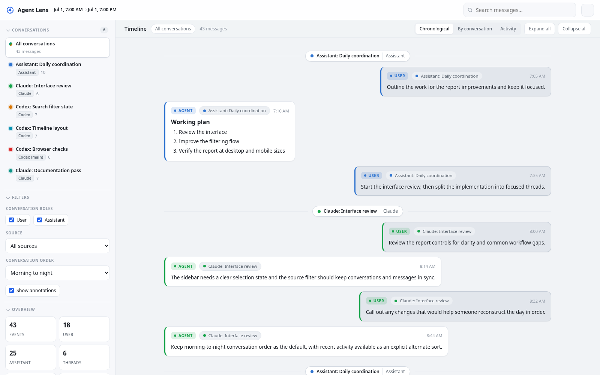
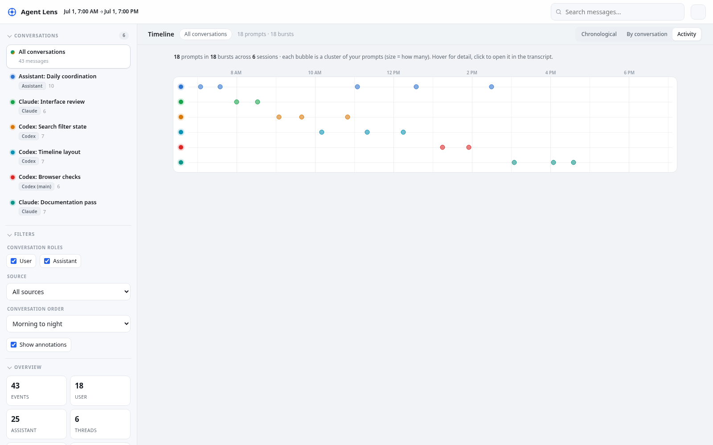

# Agent Lens

Agent Lens is a TypeScript/Bun CLI that generates a static, self-contained HTML report from agent work over a bounded time range.

Sources:

- Assistant conversation data from underlying Pi JSONL session files.
- Claude conversation data from local Claude Code JSONL project files.
- Codex conversation data from local Codex rollout JSONL files.
- Optional Codex Threads data from the `codex-threads` CLI.

The generated report embeds normalized JSON, CSS, and JavaScript. It does not require a server, CDN, or local source files after generation. V1 source timelines include only user-role and assistant-role conversation messages; tool events, request lifecycle events, audio markers, and backend status records are excluded. In the UI, Pi JSONL sessions are labeled Assistant, Claude sessions are labeled Claude, local Codex JSONL sessions are labeled Codex, and Codex Threads are split by configured instance.

`report` and `export` scan the local Assistant Pi, Claude, and Codex JSONL sources by default for the previous 24 hours, with redaction enabled. The Codex Threads CLI source is opt-in and is enabled only by a `--codex-threads-*` option. Use the `--no-assistant`, `--no-claude`, and `--no-codex` flags to limit a report to selected local sources.

Reports retain normalized messages and selected metadata only; they do not embed the original source records. The conversation sidebar follows first activity in chronological order by default, with an optional latest-activity order in the report UI.

## Screenshots

These reports use synthetic data.





The optional Codex Threads source integrates with
[`kcosr/codex-threads`](https://github.com/kcosr/codex-threads), a companion
CLI for listing, searching, reading transcripts from, and controlling Codex
app-server threads. Agent Lens uses its JSON output for the live app-server
path, while local Codex rollout JSONL remains the default source for offline
thread collection.

## Install Dependencies

```bash
npm install
```

## Build And Test

```bash
npm run build
npm run test
npm run test:smoke
npm run check
```

Build a standalone Bun executable:

```bash
npm run build:bun
./dist-bin/agent-lens --help
```

## Generate A Report

```bash
node dist/cli/main.js report \
  --since 2026-06-08T08:00:00-05:00 \
  --until 2026-06-08T17:00:00-05:00 \
  --codex-cwd /home/kevin/worktrees/agent-lens \
  --out /tmp/agent-lens-report.html
```

Useful source filters:

```bash
node dist/cli/main.js report \
  --since 2026-06-08T08:00:00-05:00 \
  --assistant-cwd /home/kevin/assistant \
  --assistant-session example-assistant-session \
  --claude-cwd /home/kevin/worktrees/agent-lens \
  --codex-thread example-codex-thread \
  --out /tmp/agent-lens-report.html
```

Export normalized JSON and render it later:

```bash
node dist/cli/main.js export --since 2026-06-08T08:00:00-05:00 --out /tmp/agent-lens.json
node dist/cli/main.js annotate --input /tmp/agent-lens.json --out /tmp/agent-lens-annotations.json
node dist/cli/main.js render \
  --input /tmp/agent-lens.json \
  --annotations /tmp/agent-lens-annotations.json \
  --out /tmp/agent-lens-report.html
```

## Report UI

The generated HTML is a self-contained, single-file reviewer with no external
dependencies. Key navigation and reading affordances:

- **Conversation sidebar** — every thread/session is listed with a color dot,
  source/instance badge, and message count. Click one to focus the timeline on just
  that conversation (or **All conversations** to clear the focus).
- **Role-distinct chat layout** — user and assistant messages are styled as
  distinct bubbles (`You` / `Agent`), each carrying a thread chip and timestamp
  so a message's conversation is never ambiguous in the merged stream.
- **Thread color coding** — a stable hue per conversation is reused across the
  sidebar, message rails, and sticky group dividers.
- **Chronological vs. By conversation** — toggle between the time-ordered merged
  stream and a view that groups every conversation's messages together. Inline
  dividers mark each thread transition, and a single sticky "currently viewing"
  header tracks the conversation under your scroll position.
- **Activity view** — a third view that drops the message text and plots the day
  as session swimlanes. Each session is a lane (color-matched to the sidebar);
  your **user prompts** are grouped into time-clustered bubbles sized by how many
  prompts each burst holds, so you can see at a glance when you worked with agents
  and on which sessions. Hover a bubble for the session, time, and a prompt
  preview; click it to jump to that prompt in the transcript. Respects the
  source filter, search, and session focus (focusing one session dims the rest).
- **Inline markdown** — message bodies render headings, lists, inline code,
  fenced code blocks, blockquotes, bold text, and links.
- **Filters** — full-text search, role toggles, source/instance filter, and an
  annotations toggle. The source/instance filter hides nonmatching threads in
  both the sidebar and the timeline. Long messages collapse with an
  expand/collapse control (plus expand-all / collapse-all).
- **Light & dark themes** — a theme toggle persists the choice and defaults to
  the OS preference.

## Annotation Sidecars

JSON sidecars can be either an array or an object with an `annotations` array:

```json
{
  "annotations": [
    {
      "id": "workstream-start",
      "kind": "section",
      "title": "Worker Thread Starts",
      "markdown": "The delegated Codex work starts here.",
      "anchorEventId": "codex:main:thread-id:item-1",
      "placement": "before"
    }
  ]
}
```

Markdown sidecars are rendered as one sidebar summary annotation.

## Non-Interactive Review Commands

List threads/sessions in an exported report:

```bash
node dist/cli/main.js threads --input /tmp/agent-lens.json
```

Read one thread/session transcript by index or id:

```bash
node dist/cli/main.js thread --input /tmp/agent-lens.json --thread 0
node dist/cli/main.js thread --input /tmp/agent-lens.json --thread 019ea850 --format json
```

Append a thread summary annotation to a sidecar:

```bash
node dist/cli/main.js annotation-add \
  --input /tmp/agent-lens.json \
  --annotations /tmp/agent-lens-annotations.json \
  --thread 0 \
  --kind summary \
  --title "Thread Summary" \
  --markdown-file /tmp/thread-summary.md
```

Append a global section divider by timestamp:

```bash
node dist/cli/main.js annotation-add \
  --annotations /tmp/agent-lens-annotations.json \
  --kind section \
  --timestamp 2026-06-08T15:40:00-05:00 \
  --title "Topic Shift" \
  --markdown "The conversation moves to report review."
```

## Optional Artifacts And Paths

The report can include a heuristic sidebar index of filesystem-like paths mentioned in normalized event text. This is off by default.

```bash
node dist/cli/main.js report \
  --since 2026-06-08T08:00:00-05:00 \
  --include-artifacts \
  --out /tmp/agent-lens-report.html
```

## Redaction

Redaction is enabled by default for report and export output. It redacts common secret-bearing fields and text patterns such as authorization headers, cookies, bearer tokens, API keys, auth tokens, passwords, and secret fields. It is not a blanket privacy filter: review reports before sharing and do not commit generated report output. Use `--no-redaction` only for local debugging.

## Limitations

- V1 summaries are deterministic and do not use an LLM.
- Tool calls/results, request lifecycle records, user-audio markers, and backend status records are intentionally excluded from v1 reports; the source timeline focuses on user-role and assistant-role messages. Annotations remain separate interpretive sidecars.
- Pi JSONL discovery walks the configured sessions root and filters by file/header timestamps and range overlap.
- Claude JSONL discovery walks the configured projects root, uses `sessions-index.json` and file mtimes for coarse filtering, then filters exact message timestamps while excluding Claude thinking/tool-use/tool-result records.
